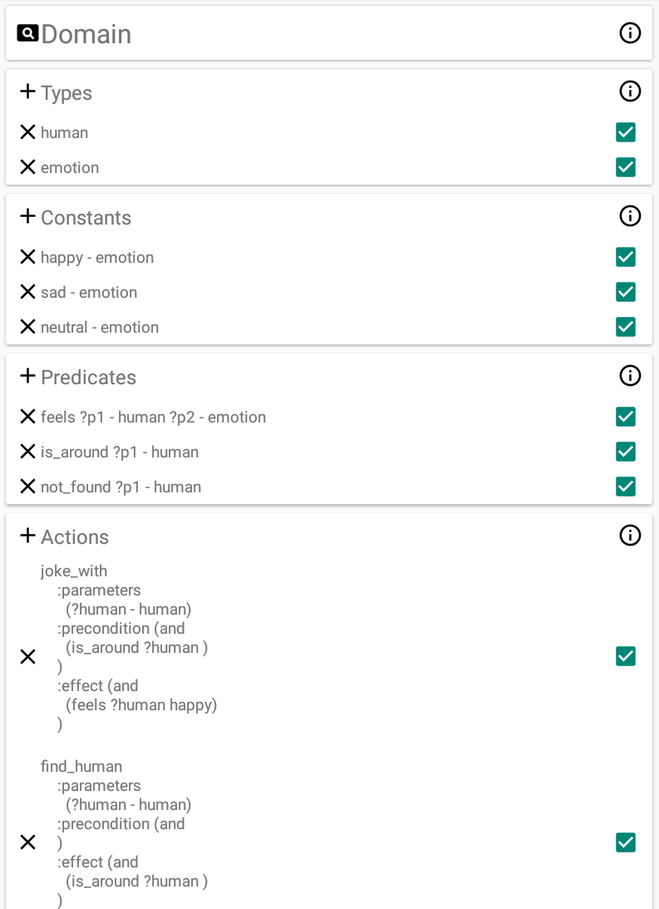
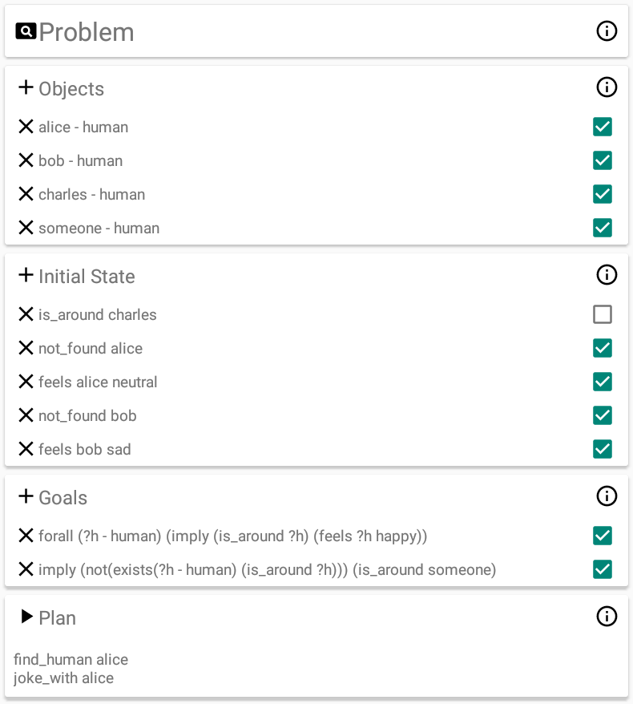

# PDDL Playground

This application aims to allow users to interactively explore the power of symbolic planners by helping them set up a planning scenario through a user-friendly interface.

## What is it for?
Symbolic planning problems are usually written in a text editor and parsed by planners at runtime. Depending on the quality of the planner, even parsing errors can be cryptic and difficult to spot, not to mention planning errors.
Even though there exist plugins for checking the validity of planning files before running the planner, these plugins do not actively help you to write them correctly in the first place.
By providing a user interface (UI) for each component of the problem, and actively constraining the range of user input, this application hopes to make it much harder for users to make mistakes.
At the same time, it is hoped that the UI helps beginners to more quickly understand the role of each component in the overall environment, as each edit made within one component affects the behavior of the other.
Finally, by virtue of having the planner as a remote service, callable dynamically, the user is free to test out different variations of the problem with the click of a button, without the need to compile or write unit tests.
Note that this application works with PDDL (short for Planning Domain Definition Language), which is a planning language used by the International Conference on Autonomous Planning and Scheduling ([ICAPS](http://www.icaps-conference.org/)).

## What is it **not** for?
This application is not meant to be a general interface for PDDL planning, but rather a *playground* for people to learn the basics of PDDL interactively. Please don't expect to use this application to [plan inter-planetary exploration](https://github.com/nasa/OpenSPIFe/wiki)!

## Requirement:
For the planning to work, the application [Fast-Downward Android](https://gitlab.aldebaran.lan/life/fast-downward-android) must be installed on the device.

## Usage:
The main view is composed of 2 groups: domain and problem.
The domain describes the "universal" aspects of a problem that do not change regardless of the specificity of a problem instance.
Conversely, the problem describes the concrete situation of the problem, such as what objects exist, what is true about them and what we want to achieve with them.

Under the domain group there are 4 components: object types, constants, predicates, and actions.
Object types define the type of objects that can exist in the world.
Constants are objects that are present in all instances of the problem.
Predicates describe some aspect of the state of the world, optionally using objects as parameters.
An action defines a transformation on the state of the world, taking objects as parameters, and predicates as preconditions and effects.

Under the problem group there are also 4 components: objects, initial states, goals, and the plan.
Objects are the set of objects that exist in a specific problem instance.
The initial state defines what predicates are true at the start of the problem.
The goal is a logical expression of predicates which must be satisfied in order for a plan to be considered a solution.
The plan is the solution to the planning problem, and the output of the planner, in this case called [Fast Downward](http://www.fast-downward.org/).
It is shown as a list of actions, potentially with known objects as parameters.

Next to each component block, there is an info button to find out more details about it.
By clicking on the plus button to the left of the component name, the user can add a new component.
Clicking on the X button to the left of the component label deletes the component.
Clicking on the checkbox disables it, meaning it will not be included in the problem description.
Clicking on the label pops up a new fragment, where the user can interactively edit the component.
Once the domain and problem are specified, the user may click on the play button next to the plan view to run the planner and see the solution.
If the planner returns an error, a Toast message notifies the user of the failure.

## A simple example
The screenshots below demonstrate a sample domain and problem created by Victor Paléologue, to get you started.
This sample describes a situation where there are some people that are in different emotional states, and in different places with respect to the agent.
The agent can perform two actions: to try to find a person, and to joke with them to make them happy. Obviously, the agent can only joke with a person when they are around.
The objective is to make everyone who is around happy, and to find someone if there is no one around.
By playing around with the components (use the checkbox to save time), you can get a feel for how they affect the plan.
When reproducing the example, make sure to fill in the components from top to bottom!

## Further Reading
The explanations of the PDDL components provided in this file and in the application is adapted from [The AI Planning & PDDL Wiki](https://planning.wiki/).
This excellent source provides in-depth information about the different versions of PDDL over the years, and a long list of planners that are designed to work with PDDL.

## TODO
* use ppdl-planning library for parsing PDDL expressions
* improve pop-up for editing goals